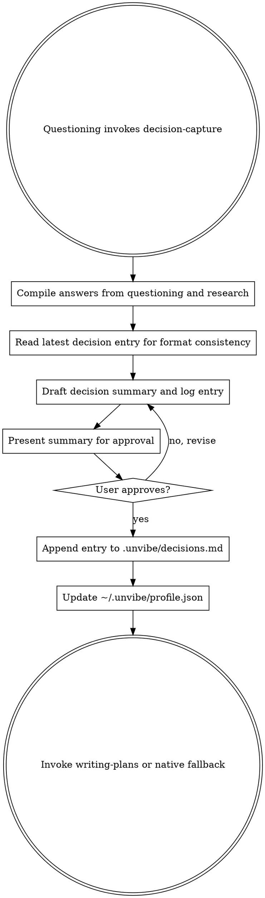

# Decision Capture

<EXTREMELY-IMPORTANT>
If `questioning` hands work to this skill, you do not skip the learning artifact.

This skill owns the decision log.

It is the only skill in the v1 bundle that appends to `.unvibe/decisions.md`.

Past entries are never modified.
</EXTREMELY-IMPORTANT>

## Chosen Flow

This implementation uses **approval before append**.

Reason: the saved artifact should match exactly what the user approved. Draft first, confirm second, append third.

## Files This Skill May Read Or Create

- `.unvibe/decisions.md`
  - If missing, create `.unvibe/` and an empty `.unvibe/decisions.md`
  - Read scope: the most recent 1 entry only
  - Write scope: append exactly 1 new entry, never rewrite older entries
- `~/.unvibe/profile.json`
  - If missing, create `~/.unvibe/` and write:

```json
{
  "experience_level": "beginner",
  "concepts_seen": {},
  "concepts_demonstrated": {},
  "calibration_notes": [],
  "seed_source": "default",
  "last_updated": null
}
```

This skill does not read or write `.unvibe/state.json`.

Runtime state files are local artifacts. Do not commit `.unvibe/decisions.md`, `.unvibe/state.json`, or `~/.unvibe/profile.json` as part of the bundle.

## Process Flow



## Checklist

1. Compile the answers from `questioning` and `research`
2. Read only the latest decision-log entry for format consistency
3. Draft the new decision summary using the fixed schema
4. Present the summary using the approval-choice contract
5. Append the approved entry to `.unvibe/decisions.md`
6. Update `~/.unvibe/profile.json` with the calibration signals gathered during questioning
7. Hand off to Superpowers `writing-plans`, or generate the plan natively if that skill is unavailable

## Fixed Schema

Use this schema exactly:

```markdown
## [YYYY-MM-DD] — [work context]: [feature/task name]

**Smallest version that would feel like a win:**
[user's answer]

**Assumptions named:**
- [assumption 1]
- [assumption 2]
- [assumption 3]

**What would make me throw this away:**
[user's answer]

**Decisions:**
- **[Decision name]: [choice].** [Reasoning, in the user's words where possible. Reference alternatives considered.]
- **[Decision name]: [choice].** [Reasoning.]
- **[Decision name]: [choice].** [Reasoning.]

**Concepts engaged:** [comma-separated list]

**Revises:** [date of prior entry] — [what changed and why]
```

`**Revises:**` is optional. Include it only when the new entry is explicitly revising a prior decision.

## Drafting Rules

- Use the user's own wording where possible
- Keep the reasoning specific to this project
- Include alternatives considered when they mattered
- Do not invent certainty the user did not show
- Keep the "concepts engaged" list useful for future calibration, not vanity labeling

## Latest-Entry Read Rules

Read only the latest entry.

Use it for:

- section-order consistency
- naming consistency
- deciding whether `Revises` should be present

Do not read back further unless the user explicitly reopens an older decision.

## Profile Update Rules

Update `~/.unvibe/profile.json` after append.

At minimum, refresh:

- `experience_level` if the session clearly shows a higher or lower calibration fit
- `concepts_seen` for concepts the user engaged with
- `concepts_demonstrated` for concepts the user used correctly
- `calibration_notes` with a short note about vocabulary, specificity, pushback quality, and whether research was needed
- `last_updated`

Do not make the profile flattering. Make it honest.

## Approval Prompt

Present the draft summary cleanly and ask for approval before writing.

Use `approval_choice` with exactly one user-facing question per turn.

When structured input is available, especially in Codex:

- `Approve draft`
- `Revise wording`
- `Revise decisions`

Put `Approve draft` first when the draft already matches the session.

When structured input is unavailable, use this fallback:

```text
Does this draft look right?

1. Approve draft
Append it and continue to planning.

2. Revise wording
Keep the decisions, but tighten or rewrite the summary.

3. Revise decisions
One or more decisions are wrong or incomplete.

Reply with 1, 2, 3, or your own answer.
```

If the user wants changes:

- revise the draft
- keep the discussion in the current session
- append only after approval

## Handoff

After append and profile update:

- If Superpowers `writing-plans` is available, announce that handoff and invoke it
- If `writing-plans` is unavailable, generate the implementation plan natively from the approved decision entry

Do not create `plan-generation/SKILL.md`.

## Anti-Patterns

Never do any of these:

- read the whole decision log
- modify or delete an older entry
- append before approval in this v1 bundle
- rewrite the user's reasoning into generic agent voice
- skip the learning artifact because the plan feels obvious
- bury the approval step inside a prose paragraph with no clear action choices

## Terminal State

The work leaves Unvibe here and moves into planning:

- `writing-plans` if available
- native plan generation if not
