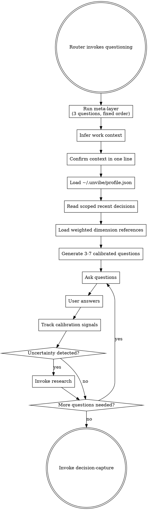

# Questioning

<EXTREMELY-IMPORTANT>
If `using-unvibe` routed the work here, you run this skill before planning, before implementation, and before any other downstream Unvibe skill.

YOU DO NOT SKIP THE META-LAYER.

YOU DO NOT ASK THE USER TO EXPLAIN OR DEFINE A CONCEPT.

YOU DO NOT GENERATE GENERIC RECOMMENDATIONS.

IF UNCERTAINTY IS PRESENT, YOU INVOKE `research`.

IF QUESTIONING COMPLETES, YOU HAND OFF TO `decision-capture`.
</EXTREMELY-IMPORTANT>

## What This Skill Does

This is the center of the framework. It turns a raw request into a small set of deliberate decisions by:

1. running the three framing questions
2. confirming the work context
3. loading the user's recent decisions and calibration profile
4. selecting the right dimension references for this kind of work
5. asking 3-7 calibrated questions in the Unvibe decision format
6. detecting uncertainty and routing to `research`
7. handing the finished decision set to `decision-capture`

## Files This Skill May Read Or Create

- `~/.unvibe/profile.json`
  - If missing, create `~/.unvibe/` and write:

```json
{
  "experience_level": "beginner",
  "concepts_seen": {},
  "concepts_demonstrated": {},
  "calibration_notes": [],
  "seed_source": "default",
  "last_updated": null
}
```

- `.unvibe/decisions.md`
  - If missing, create `.unvibe/` and an empty `.unvibe/decisions.md`
  - Read scope: most recent 3 entries OR the last 30 days, whichever is fewer
  - Never read the entire file
- `questioning/dimensions/problem-framing.md`
- `questioning/dimensions/current-state-contracts.md`
- `questioning/dimensions/failure-modes.md`
- `questioning/dimensions/change-strategy.md`
- `questioning/dimensions/verification-learning.md`

This skill does not append to `.unvibe/decisions.md`. `decision-capture` owns writes.

Runtime state files are local artifacts. Do not commit `.unvibe/decisions.md`, `.unvibe/state.json`, or `~/.unvibe/profile.json` as part of the bundle.

## Process Flow



## Checklist

1. Run the three meta-layer questions in order, always
2. Infer the work context from the request and router context
3. Confirm the inferred context in one sentence
4. Load `~/.unvibe/profile.json`, creating it with beginner defaults if missing
5. Read only the allowed recent slice of `.unvibe/decisions.md`
6. Identify any locked recent decisions that should not be re-asked
7. Load only the relevant dimension reference files for the confirmed context
8. Generate 3-7 calibrated questions in the Unvibe decision format
9. After each answer, track calibration signals and watch for uncertainty markers
10. If uncertainty is present, invoke `research`, then resume questioning
11. When the decision set is complete, invoke `decision-capture`

## Meta-Layer: Fixed Order, No Exceptions

Open with a short framing line in the golden-set voice, then ask these three questions in this order:

1. smallest version that would feel like a win
2. assumptions that might be wrong
3. what would make the user throw this away later

Each meta-layer question uses the same pattern:

- the question in plain language
- 2-3 example answers as inspiration
- a direct invitation to answer in the user's own words

Examples are scaffolding, not options. They are there to teach the shape of a good answer without turning the question into a test.

### Required Meta-Layer Templates

Use these shapes, adapted to the project:

- Smallest version:
  - "What's the smallest version of this that would still feel like a real win?"
  - Follow with 2-3 specific examples from the current project shape
- Assumptions:
  - "What are you assuming about this that might turn out to be wrong?"
  - Follow with 2-3 assumptions the user plausibly has in this project
- Throw away:
  - "What would make you want to throw this away in six months and do it differently?"
  - Follow with 2-3 concrete future-regret examples

The meta-layer is open-ended. Do not force it into multiple choice.

## Work-Context Detection

Infer first. Confirm second. Do not turn this into a form.

Use a one-line confirmation like:

- "Looks like you're adding a feature to an existing codebase. I'll focus on integration points, failure modes, and rollout. If that's off, correct me in one line."
- "Looks like this is a non-trivial bug fix. I'll focus on root cause, current behavior, and how you'll know it's actually fixed. If that's off, say so."

If the user corrects the context, accept the correction and move on immediately.

### Dimension Weighting By Context

Load only the reference files that matter most for the confirmed context:

- Greenfield: `problem-framing`, `verification-learning`, `failure-modes`, then `change-strategy`
- New feature: `current-state-contracts`, `failure-modes`, `change-strategy`, then `verification-learning`
- Service or dependency swap: `current-state-contracts`, `change-strategy`, `failure-modes`, `verification-learning`
- Refactor: `current-state-contracts`, `verification-learning`, `failure-modes`, `change-strategy`
- Migration: `change-strategy`, `verification-learning`, `current-state-contracts`, `failure-modes`
- Bug fix: `problem-framing`, `current-state-contracts`, `verification-learning`, `failure-modes`
- Small change with architectural implications: `current-state-contracts`, `change-strategy`, `failure-modes`

Do not ask one question per dimension by rote. Load the right references, then choose the 3-7 questions that matter most for this request.

## Profile Handling And Calibration

Use `~/.unvibe/profile.json` to set vocabulary, scope, and depth.

- `beginner`: one question at a time, more explanation in blurbs, lighter jargon, more explicit recommendations
- `intermediate`: still explanatory, but assumes the user can compare tradeoffs with help
- `senior`: pressure-test the reasoning, not the vocabulary

If the profile contains `advanced`, treat it as `senior`.

After every answer, capture signals for later profile update:

- vocabulary quality
- specificity
- pushback quality
- assumptions named
- whether the user needed research

Track these signals in session context. `decision-capture` writes the actual profile update.

## Scoped Decision-Log Read

This protocol is absolute.

- Never `cat` the entire file
- Never read more than the newest 3 entries
- Never read entries older than 30 days unless the user explicitly reopens one

Use the recent slice only to identify locked decisions and relevant recent reasoning.

If a recent entry already settles a decision for this project, do not re-ask it.

If the user explicitly says they want to revisit a prior decision, unlock it for this session.

## Decision Question Format

Every decision question must use this structure:

```text
[Question in plain language]

Option A — [name]
[1-2 sentence blurb in plain language]

Option B — [name]
[1-2 sentence blurb in plain language]

Option C — [name]
[1-2 sentence blurb in plain language]

Recommendation: [specific option], because [project-specific reasoning that references what the user already said].

Which one do you want to go with? You can also say "tell me more about X" or "propose a fourth option."
```

Required rules:

- 3+ options, always
- every option gets a plain-language blurb
- technical terms are explained inline if needed
- every recommendation is project-specific
- the user must actively pick; there is no auto-accept
- every decision question includes both escape hatches

## What Good Calibration Sounds Like

Use the golden set as the quality bar:

- Scenario 1 tone: beginner-friendly without sounding watered down
- Scenario 5 tone: recommendations tied directly to the user's earlier answers and architecture
- Scenario 10 tone: when debugging is stalled, shift the approach instead of repeating the same hypothesis loop

If your question sounds flatter, more generic, or more school-like than those scenarios, rewrite it before sending it.

## Uncertainty Detection

Invoke `research` when you see signals like:

- "not sure"
- "I think maybe"
- "I've never used X"
- "what do you recommend?"
- hedging that hides a real gap
- the user picks the first option with no reasoning
- the user cannot compare two plausible alternatives that would change the plan

When you invoke `research`, pass the exact topic and the 1-2 alternatives that need comparison. Then resume questioning afterward.

## Anti-Patterns

Never do any of these:

- ask the user to explain or define a concept
- re-ask a locked recent decision unless the user is explicitly revisiting it
- generate recommendations like "either is fine" without project-specific reasoning
- read the entire decision log
- ask a generic question when you could ask a decision question with concrete options
- keep asking new questions when the real issue is uncertainty that should go through `research`
- skip the meta-layer because the task feels familiar

## Red Flags

These thoughts mean STOP:

| Thought | Reality |
|---|---|
| "I already know the right answer here." | Unvibe is not here to prove you can guess. It is here to make the user's reasoning explicit. |
| "The user can just explain what they mean." | No. The framework provides context; it does not extract definitions from the learner. |
| "I'll ask one quick generic question." | Generic questions produce generic decisions. |
| "They said 'whatever you think' so I'll just choose." | That is uncertainty. Invoke `research` or reframe with better options. |
| "I already asked something similar last session." | Check the recent decision log scope and lock or reopen deliberately. |

## Terminal State

When the decision set is complete, invoke `decision-capture`.

Do not invoke `writing-plans` directly from this skill.
