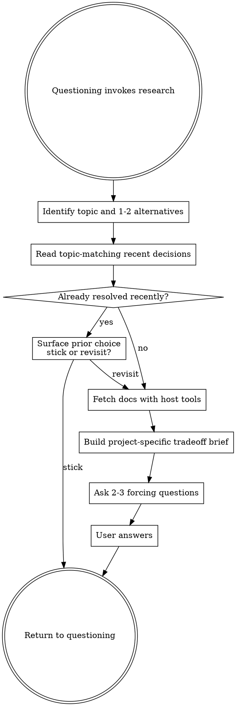

# Research

<EXTREMELY-IMPORTANT>
This skill is subordinate to `questioning`.

It does not replace questioning.

It does not become a lecture.

It exists to resolve the one uncertainty that would most change the plan if clarified.
</EXTREMELY-IMPORTANT>

## Files This Skill May Read Or Create

- `.unvibe/decisions.md`
  - If missing, create `.unvibe/` and an empty `.unvibe/decisions.md`
  - Read scope: up to 3 entries matching the current topic
  - Never read unrelated entries
  - Never read the full file

This skill does not write `.unvibe/decisions.md`, `.unvibe/state.json`, or `~/.unvibe/profile.json`.

Runtime state files are local artifacts. Do not commit them as part of the bundle.

## Process Flow

## Checklist

1. Identify the exact uncertain topic and the 1-2 real alternatives
2. Read only the allowed topic-matching slice of `.unvibe/decisions.md`
3. If the same topic was resolved recently, surface it and ask whether to revisit or stick
4. Fetch docs using whatever host tools are available
5. Build a short tradeoff brief with 3 differences that matter for this project
6. Ask a 2-3 question forcing-function quiz
7. Return control to `questioning`

## Topic Detection

Keep the topic concrete.

Good:

- "Astro vs Next.js for a first portfolio site"
- "Supabase realtime vs Yjs for collaborative cursors"
- "Retry queue in Redis vs SQS for customer webhooks"

Bad:

- "frontend"
- "databases"
- "architecture"

If the topic is fuzzy, tighten it before doing any research.

## Scoped Decision-Log Read

Read only entries that actually match the current topic, capped at 3.

If a recent entry resolved the exact same decision, surface it like this:

> "You researched this on [date] and chose [X] because [Y]. Want to revisit that, or stick with it?"

Behavior rules:

- If the topic match is exact and recent, offer stick-or-revisit before fetching anything
- If the topic is only loosely related, use the prior entry as context, not as a lock
- If the prior entry is old enough that the landscape may have changed, say so plainly

## Doc Fetching

Use the host's available doc tools. Do not hardcode a transport.

Preferred order:

1. official docs or primary docs for each option
2. project docs or codebase docs if the uncertainty depends on the current system
3. secondary sources only when primary docs do not answer the real tradeoff

If no fetch tools are available, say so briefly and fall back to the best local information you have.

## Tradeoff Brief Rules

Keep the brief to 3 concrete differences that matter for this project.

Good brief:

- tied to the user's actual constraints
- specific about where each option wins
- includes at least one difference the user probably had not named yet

Bad brief:

- generic feature matrix
- vendor-marketing summary
- long lecture about history or internals that do not affect the decision

The brief should feel like a useful detour, not a class.

## Forcing-Function Quiz

Ask 2-3 short questions that make the user articulate their choice.

Good quiz questions:

- "Which difference matters most for this project: easier setup now, safer rollback later, or better fit for the behavior you want next?"
- "If your first assumption is wrong in two months, which option is cheaper to unwind?"
- "Which downside are you more willing to live with here?"

Bad quiz questions:

- "What is Yjs?"
- "Explain the difference between polling and realtime."
- "Define idempotency."

There are no wrong answers. The goal is clarity, not testing.

## Time Box

Keep this to roughly 2-3 minutes of useful work.

If you are about to turn it into a document dump, stop and compress.

## Anti-Patterns

Never do any of these:

- read the entire decision log
- run research on a topic that is already clear
- present a generic comparison instead of a project-specific one
- quiz the user on definitions
- stay in research after the uncertainty is resolved

## Terminal State

Return to `questioning` with:

- the topic
- the alternatives
- the 3 project-specific differences
- the user's clarified preference or the remaining unresolved split
