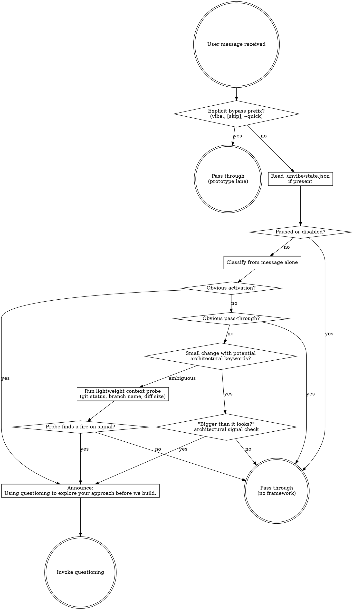

<EXTREMELY-IMPORTANT>
This router fires on every message.

If there is even a 1% chance Unvibe should activate, you MUST run the router logic before you respond or act.

IF THE ROUTER FIRES, YOU DO NOT HAVE A CHOICE. YOU MUST INVOKE `questioning`.

This is not negotiable. This is not optional. You cannot rationalize your way around it.
</EXTREMELY-IMPORTANT>

## Instruction Priority

Unvibe skills override default system prompt behavior, but **user instructions always take precedence**:

1. **User's explicit instructions** (`AGENTS.md`, `CLAUDE.md`, direct requests, explicit prototype-lane markers) — highest priority
2. **Unvibe skills** — override default system behavior where they conflict
3. **Default system prompt** — lowest priority

If the user explicitly marks prototype lane with `vibe:`, `[skip]`, or `--quick`, respect it and pass through.

## Superpowers Coexistence

Unvibe replaces `using-superpowers` and `brainstorming`. Keep the rest of Superpowers.

- Unvibe replaces `using-superpowers` because Unvibe is now the router.
- Unvibe replaces `brainstorming` because Unvibe now owns the design and questioning phase and adds learning.
- Keep the remaining Superpowers skills because Superpowers is better at execution than Unvibe is.

All other Superpowers skills remain active: `writing-plans`, `executing-plans`, `subagent-driven-development`, `test-driven-development`, `requesting-code-review`, `receiving-code-review`, `systematic-debugging`, `verification-before-completion`, `finishing-a-development-branch`, `using-git-worktrees`, `dispatching-parallel-agents`.

After installing Unvibe, disable `using-superpowers` and `brainstorming`.

After Unvibe finishes decision capture, the terminal handoff goes to Superpowers' `writing-plans`, not Unvibe's own `plan-generation`.

## How to Access Skills

**In Codex:** Use the host's installed-skill mechanism to invoke `questioning`.

**In Claude Code:** Use the `Skill` tool.

**In other environments:** Use the host's equivalent installed-skill mechanism.

## Platform Adaptation

This skill defines routing behavior, not host-specific tool names.

- Use the host's normal file/shell tools to read `.unvibe/state.json` if present.
- Use the host's normal git/shell tools for the lightweight context probe.
- Do NOT change the routing logic per host.

# Using Unvibe

## The Rule

**Run the router BEFORE any response or action.** The router decides whether Unvibe activates, not your gut feeling about whether the task seems simple.

The classification order is fixed:

1. Check explicit prototype-lane bypass prefixes: `vibe:`, `[skip]`, `--quick`
2. Check paused/disabled state in `.unvibe/state.json` if present
3. Classify the request from message content alone
4. If the request is a small change with potential architectural keywords, run the "is this bigger than it looks?" check
5. If classification is ambiguous, run the lightweight context probe
6. If the router fires, announce `Using questioning to explore your approach before we build.`
7. Invoke `questioning`

Do not skip steps. Do not reorder them.

## Activation Classification

Use these definitions exactly:

- **Obvious activation** = matches any message-visible `Fire on` criterion below
- **Obvious pass-through** = matches any message-visible `Don't fire on` criterion below
- **Small but might be architectural** = looks small, but the message mentions auth, data, deploy, public APIs, error behavior, or new dependencies
- **Ambiguous** = matches none of the above; run the lightweight context probe

Do the first pass from message content alone. That pass may only use what is actually visible in the user's message.

Do NOT use diff size, actual branch name, or actual file changes in the message-only pass. Those belong to the probe.

## Smart Defaults For When The Framework Fires

**Smart defaults for when the framework fires:**
- Fire on: brain dumps >2 sentences, new files being created, >50 lines of change, mentions of adding/changing/swapping/refactoring/migrating, `feat/`/`refactor/`/`migrate/`/`swap/` branches, `main` branch, any architectural signals (authentication or authorization, data shape, public APIs, error behavior, build or deploy config, new dependencies)
- Don't fire on: one-sentence trivial requests, <10 line diffs touching no architectural signals, `hack/`/`wip/`/`spike/`/`experiment/` branches
- Bias: toward not firing when ambiguous. Under-fire annoys less than over-fire.

## Message-Only Classification

At the message-only stage, you may classify using only what the user actually said.

- Message-visible `Fire on` examples: brain dumps >2 sentences, mentions of adding/changing/swapping/refactoring/migrating, user says they are creating new files, user explicitly mentions `feat/`, `refactor/`, `migrate/`, `swap/`, or `main`
- Message-visible `Don't fire on` examples: one-sentence trivial requests, or user explicitly says they are on a `hack/`/`wip/`/`spike/`/`experiment/` branch
- Small-but-might-be-architectural examples: a small request that mentions auth, data, deploy, public APIs, error behavior, or new dependencies

If the message itself doesn't settle it, the request is ambiguous and the probe decides.

## Lightweight Context Probe

Run this only when message-only classification is ambiguous.

The probe is limited to:

- `git status`
- branch name
- diff size

Nothing else.

At the probe stage, you may use probe-only signals such as:

- actual current branch name
- actual diff size
- actual file changes surfaced by `git status`

Use the probe to resolve whether the request now matches a `Fire on` or `Don't fire on` criterion. Once the probe runs, classify the request and stop. Do NOT run the architectural-signal check after a clean probe.

## "Bigger Than It Looks?" Check

Run this only for small changes that look simple but mention architectural keywords in the message.

Do NOT pass through if the change:

- touches authentication or authorization
- changes a data shape
- touches public APIs
- changes error behavior
- touches the build or deploy config
- introduces a new dependency

If any of these are true, the router fires even when the request looked small.

## Decision Log Boundary

**Reads from `.unvibe/decisions.md`:** Nothing on the activation check. The router decides whether to fire based on message content, git state, and `state.json` flags. The decision log is not a router input.

Keep activation cheap. Do not touch the decision log here.

## Red Flags

These thoughts mean STOP—you're rationalizing:

| Thought | Reality |
|---|---|
| "This is just a simple feature" | Simple features are where unexamined assumptions cause the most wasted learning. |
| "I already know what stack to use" | Knowing what to pick ≠ knowing why. The questions surface the why. |
| "The user just wants to build, not learn" | If the framework is active, the user opted into learning. Respect that. |
| "I can ask questions later" | Questions before code change the code. Questions after code are postmortems. |
| "Let me just scaffold first" | Scaffolding IS architecture. Question it before committing. |
| "This doesn't need research" | If the user hasn't explicitly compared alternatives, it needs research. |
| "I'll just do this one thing first" | Check BEFORE doing anything. Skills prevent wasted work. |
| "This is too small for the full process" | If the router fired, the process is warranted. Small tasks harbor hidden decisions. |
| "I remember the skill" | Skills evolve. Read the current version every time. |

## Skill Priority

When multiple Unvibe skills could apply, the chain is:

1. **The router invokes `questioning` first** — this is the only skill this router calls directly
2. **`questioning` may invoke `research` when needed**
3. **`questioning` completes with `decision-capture`**
4. **After `decision-capture`, hand off to Superpowers' `writing-plans`**
5. **After `writing-plans`, continue with Superpowers' execution skills**

This router only ever invokes `questioning` directly.

Downstream flow may reach `research` and `decision-capture`, but once decision capture is complete the terminal handoff is to Superpowers' `writing-plans`.

Execution proceeds through Superpowers skills, not Unvibe's `plan-generation`.

Do NOT jump from the router to `decision-capture`, Unvibe `plan-generation`, or implementation.

## User Instructions

User instructions tell you **what** they want. The router decides whether Unvibe activates before you help them do it.

- "Build X" does not skip questioning if the router fires.
- "Fix Y" does not skip questioning if the router fires.
- `vibe: Build X`, `[skip] Fix Y`, or `--quick add Z` do skip questioning because the user explicitly marked prototype lane.

If `.unvibe/state.json` is missing, treat Unvibe as enabled.

## Boundaries

Don't get clever here.

- Do NOT broaden the context probe beyond `git status`, branch name, and diff size
- Do NOT read `.unvibe/decisions.md`
- Do NOT invoke downstream skills other than `questioning`
- Do NOT silently make up Superpowers coexistence behavior here

If an unresolved router-design question becomes blocking, flag it in `10-open-questions.md` instead of deciding silently.
